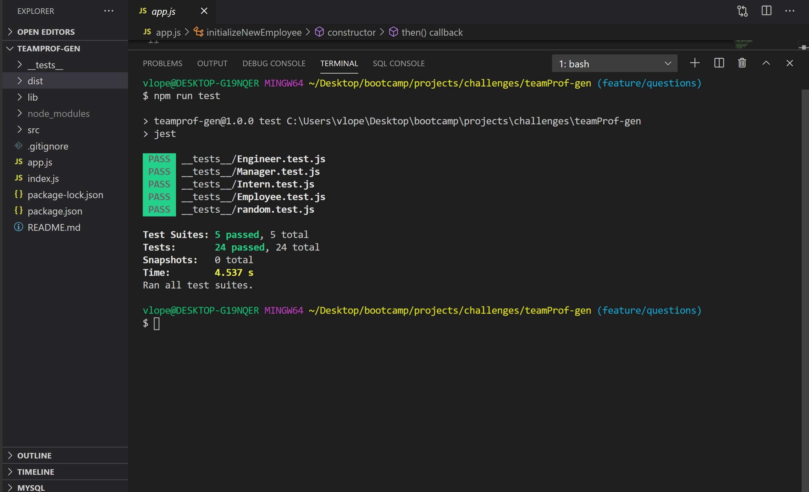

# TeamProfile-Gen

## Table of Contents

* [Description](#description)

* [Preview](#preview)

* [Usage](#usage)

* [Questions](#questions)

## Description

- I am prompted for my team members and their information
     an HTML file is generated that displays a nicely formatted team roster based on user input

- I click on an email address in the HTML
     my default email program opens and populates the TO field of the email with the address

- I click on the GitHub username
     that GitHub profile opens in a new tab

- I start the application
     I am prompted to enter the team manager’s name, employee ID, email address, and office number

- I enter the team manager’s name, employee ID, email address, and office number
     I am presented with a menu with the option to add an engineer or an intern or to finish building my team

- I select the engineer option
     I am prompted to enter the engineer’s name, ID, email, and GitHub username, and I am taken back to the menu

- I select the intern option
     I am prompted to enter the intern’s name, ID, email, and school, and I am taken back to the menu

- I decide to finish building my team
     I exit the application, and the HTML is generated

## Usage

Run npm install , to install all packages. To run tests do `npm run test` in the command line to run all. To run a specific test, give a specific name ex: `npm run test manager`. To open the question prompts, in the command line, use `node index.js` and select answers. This should generate a file in the /dist folder with your generated html. 

## Preview

## Links
[Link to demo](https://drive.google.com/file/d/1ckGVjxARotJ7c9THok_vZQ9EIAyCT0ej/view?usp=sharing)